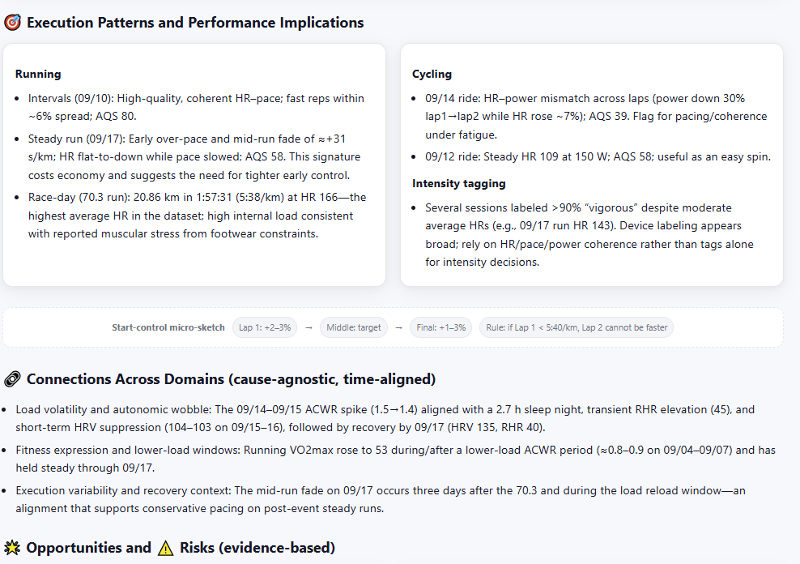
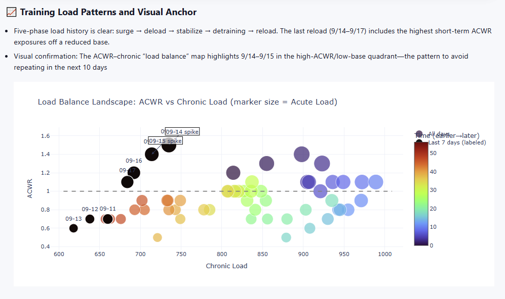
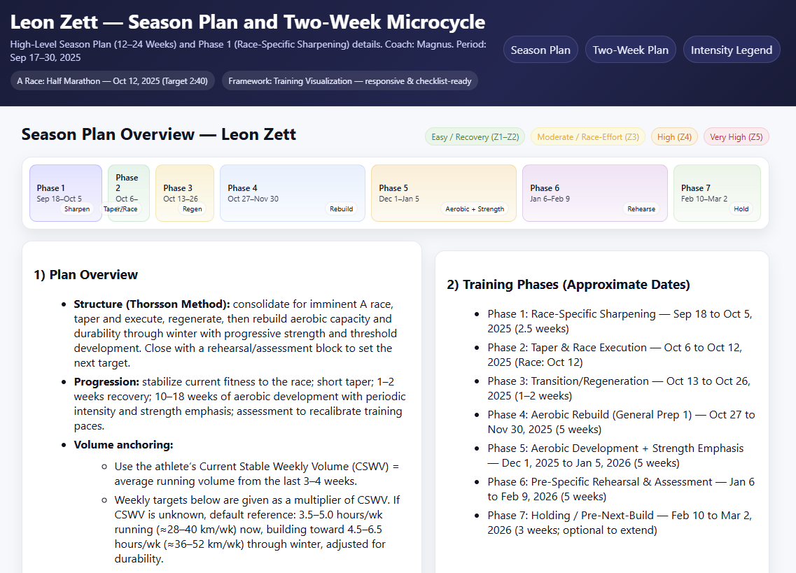
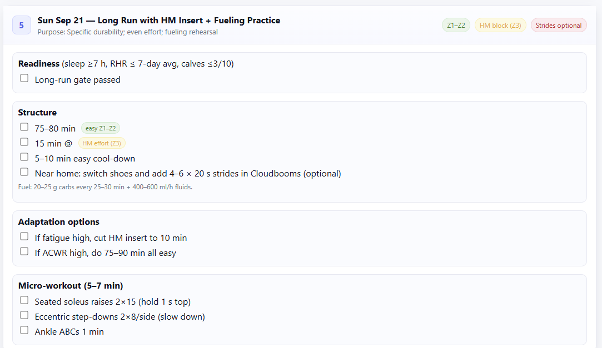

# 🏊‍♂️🚴‍♂️🏃‍♂️ Your AI Endurance Coach

> **Transform your Garmin Connect data into personalized insights, training plans, and race prep strategies using a sophisticated multi-agent AI system.**

[](https://python.org)
[](https://langchain-ai.github.io/langgraph/)
[](LICENSE)

Provider-agnostic: OpenAI (incl. GPT-5), Anthropic, and OpenRouter are supported.

---

## ✨ What Makes This Special

- Parallel analysis across specialized agents (load, physiology, execution)
- Interactive reports with evidence and actionable next steps
- CLI-first, config-driven headless runs
- Telegram bot interface (deprecated) — see Deprecated section below
- Privacy-first: local encrypted credentials; no cloud storage of personal data
- Built-in observability and cost tracking (LangSmith)

---

## 🎯 See It In Action

### Your Personal AI Coaching Team

```mermaid
flowchart LR
    subgraph Analysis Team
        A[📊 Dr. Aiden<br/>Metrics] --> E[🧠 Maya<br/>Synthesis]
        B[🏃‍♂️ Marcus<br/>Activity Data] --> C[🔍 Elena<br/>Interpreter]
        D[❤️ Dr. Helena<br/>Physiology] --> E
        C --> E
        E --> F[📋 James<br/>Analysis Formatter]
        F --> PR[🖼️ Plot Resolution]
    end

    subgraph Planning Team
        S[🧭 Coach Magnus<br/>Season Planner] --> DI[🧩 Data Integration]
        DI --> W[📅 Coach Magnus<br/>Weekly Planner]
        W --> PXF[🎨 Pixel<br/>Plan Formatter]
    end

    %% Integrated flow from analysis to planning
    PR --> S

    %% Weekly planner consumes analysis results directly (kept simple)
    A -. signals .-> W
    C -. patterns .-> W
    D -. physiology .-> W

    %% Outputs
    F --> G1[📊 Analysis HTML]
    PXF --> G2[📄 Planning HTML]
```

**Each agent brings specialized expertise:**
- **Dr. Aiden Nakamura** (Metrics) - Training load, VO₂ max trends, performance metrics
- **Marcus Chen** (Activity Data) - Raw training data processing and pattern recognition
- **Elena Rodriguez** (Activity Interpreter) - Training pattern analysis and execution insights
- **Dr. Helena Virtanen** (Physiology) - Recovery, stress, and physiological markers
- **Maya Lindholm** (Synthesis) - Combines insights into comprehensive analysis
- **James Morrison** (Analysis Formatter) - Creates analysis HTML and handoff artifacts
- **Coach Magnus Thorsson** (Season Planner) - Long-term periodization frameworks and peak timing
- **Coach Magnus Thorsson** (Weekly Planner) - Practical 14‑day training plans with zones and adaptations
- **Data Integration** (Planning) - Integrates analysis, plots, and competitions to contextualize planning
- **Pixel** (Plan Formatter) - Produces professional planning HTML with interactive checklists

### 📊 Beautiful Analysis Reports


*Executive summary and key performance indicators with readiness signals*


*Execution patterns and coaching notes derived from recent runs and rides*


*Bubble map of ACWR versus chronic load (marker size = acute load) with annotated high‑risk exposures*

**Analysis Report Features:**
- 🎯 **Executive Summary** with key findings and readiness scores
- 📈 **Interactive Training Load Charts** with ACWR analysis
- ❤️ **Physiological Adaptation Tracking** (HRV, stress patterns, VO₂ max)
- ⚠️ **Critical Pattern Analysis** identifying training inconsistencies
- 🏁 **Competition Readiness Assessment** with timeline planning
- 💡 **Actionable Recommendations** prioritized by urgency

### 📅 Detailed Training Plans


*Periodized macrocycle with phase-specific goals, timeline, and progression guardrails*


*Structured day plan with intensity zones, adaptations, and monitoring cues*

**Planning Report Features:**
- 🏗️ **Season-Long Periodization** with phase-specific goals
- 📋 **Day-by-Day Workout Details** with intensity zones and adaptations
- 🎯 **Training Zone References** for running, cycling, and swimming
- 📊 **Volume and Intensity Monitoring** with built-in flexibility
- 🔄 **Adaptive Workout Options** based on readiness and fatigue

---

## 🚀 Quick Start (CLI-first)

```bash
# 1) Create your configuration
pixi run coach-init my_training_config.yaml

# 2) Edit the config with your details, then run
pixi run coach-cli --config my_training_config.yaml
```

### CLI command reference

```bash
# Run with an existing config
python cli/garmin_ai_coach_cli.py --config my_training_config.yaml [--output-dir ./data]

# Generate a new config template
python cli/garmin_ai_coach_cli.py --init-config my_training_config.yaml
```

Options:
- --config PATH — Path to YAML or JSON config
- --init-config PATH — Create a template config at PATH
- --output-dir PATH — Override output directory from config

**Outputs:**
- `analysis.html` - Comprehensive performance analysis
- `planning.html` - Detailed weekly training plan
- `metrics_result.md`, `activity_result.md`, `physiology_result.md`, `season_plan.md` - Intermediate artifacts
- `summary.json` - Metadata and cost tracking with keys:
  - `total_cost_usd`, `total_tokens`, `execution_id`, `trace_id`, `root_run_id`, `files_generated`, `competitions`

### Legacy: Telegram Bot (Deprecated)
The Telegram chat interface is deprecated and will be removed in a future release. Prefer the CLI.
If you still need to use it temporarily:
```bash
pixi run start-dev
```
Requires `TELE_BOT_KEY` in your environment. See the “Project Structure” section for legacy notes.
---

## 💻 Installation & Setup

### Prerequisites
- Garmin Connect account (your training data source)
- LLM API key for your chosen provider (OpenAI, Anthropic, or OpenRouter)
- Optional: `LANGSMITH_API_KEY` for observability
- Legacy Telegram bot requires `TELE_BOT_KEY` — see “Legacy: Telegram Bot (Deprecated)” above
### Using Pixi (Recommended)

1. **Create your environment file:**
```bash
# .env (or .env.dev)

# Choose at least one provider
OPENAI_API_KEY=sk-...
ANTHROPIC_API_KEY=sk-ant-...
OPENROUTER_API_KEY=...
LANGSMITH_API_KEY=lsv2_...  # Optional: professional observability

# AI mode default (overridden by config's extraction.ai_mode)
AI_MODE=development
```

Important: Provider mapping and AI mode
- If you only set OPENAI_API_KEY, set your config `extraction.ai_mode: "standard"` (this mode maps to an OpenAI model by default), or update the mapping in [`services/ai/ai_settings.py`](services/ai/ai_settings.py:24) within [`python.AISettings()`](services/ai/ai_settings.py:19) so your chosen mode points to an OpenAI model (e.g., `gpt-4o`, `gpt-5-mini`).
- The CLI exports `AI_MODE` from your config at [`cli/garmin_ai_coach_cli.py`](cli/garmin_ai_coach_cli.py:126); model IDs are defined in [`python.ModelSelector.CONFIGURATIONS`](services/ai/model_config.py:22), and the provider key is auto-selected in [`python.ModelSelector.get_llm()`](services/ai/model_config.py:61).

2. **Install and run (CLI):**
```bash
pixi run coach-init my_training_config.yaml
pixi run coach-cli --config my_training_config.yaml
```

### Alternative Installation (CLI without Pixi)
```bash
pip install -r requirements.txt
python cli/garmin_ai_coach_cli.py --init-config my_training_config.yaml
python cli/garmin_ai_coach_cli.py --config my_training_config.yaml
```

---

## 🎛️ AI Configuration & Models

### AI Modes
Choose your analysis depth and cost balance:

- **`development`** - Fast iterations, cost-effective (7-14 days data)
- **`standard`** - Comprehensive analysis (21-56 days data) 
- **`cost_effective`** - Balanced approach for budget-conscious users

### Supported LLM Providers

- **🤖 OpenAI**
  - `gpt-5`, `gpt-5-mini`
  - `gpt-4.5`, `gpt-4.1`, `gpt-4o`, `gpt-4o-mini`
  - `o1`, `o1-mini`, `o3`, `o3-mini`, `o4-mini`

- **🧠 Anthropic Claude**
  - `claude-4`, `claude-4-thinking`
  - `claude-opus`, `claude-opus-thinking`
  - `claude-3-haiku`

- **🚀 OpenRouter/DeepSeek**
  - `deepseek-chat`, `deepseek-reasoner`

*Configure in [`services/ai/ai_settings.py`](services/ai/ai_settings.py:24) by updating the `stage_models` mapping in [`python.AISettings()`](services/ai/ai_settings.py:19).*

Important — provider selection depends on your AI mode:
- Default mapping in [`services/ai/ai_settings.py`](services/ai/ai_settings.py:24):
  - `standard` → `gpt-5` (OpenAI)
  - `development` → `claude-4` (Anthropic)
  - `cost_effective` → `claude-3-haiku` (Anthropic)
- The CLI exports `AI_MODE` from your config’s `extraction.ai_mode` at [`cli/garmin_ai_coach_cli.py`](cli/garmin_ai_coach_cli.py:126).
- If you only set `OPENAI_API_KEY`, use `ai_mode: "standard"` (default maps to an OpenAI model) or update `stage_models` to point your chosen mode to an OpenAI model (e.g., `gpt-4o`, `gpt-5-mini`) in [`services/ai/ai_settings.py`](services/ai/ai_settings.py:24). Available model IDs are defined in [`python.ModelSelector.CONFIGURATIONS`](services/ai/model_config.py:22), and the provider is auto-selected in [`python.ModelSelector.get_llm()`](services/ai/model_config.py:61).
- If you only set `ANTHROPIC_API_KEY`, keep `ai_mode: "development"` or `"cost_effective"` (both map to Anthropic by default) or change the mapping.
- If you use OpenRouter (e.g., DeepSeek), map your mode to an OpenRouter model key from [`python.ModelSelector.CONFIGURATIONS`](services/ai/model_config.py:22).

---

## 📋 Configuration

Analysis vs Planning context:
- Analysis context: how to interpret past data (e.g., risk tolerance, injury notes, priorities)
- Planning context: how to plan future training (e.g., emphasis, constraints, races). This is freeform text interpreted by the AI.

### Minimal config
```yaml
athlete:
  name: "Your Name"
  email: "you@example.com"

context:
  analysis: "Recovering from injury; focus on base building"
  planning: "Olympic triathlon in 12 weeks; build aerobic base"

extraction:
  activities_days: 7
  metrics_days: 14
  ai_mode: "development"   # or "standard" or "cost_effective"

competitions:
  - name: "Target Race"
    date: "2026-04-15"
    race_type: "Olympic"
    priority: "A"

output:
  directory: "./data"

credentials:
  password: ""   # Leave empty to be prompted securely at runtime
```

### Advanced config (derived from real usage)
```yaml
athlete:
  name: "Athlete Name"
  email: "you@example.com"

context:
  analysis: |
    Completed my first 70.3 recently. Great result but exposed durability gaps
    due to last-minute shoe change. Analyze this multisport activity in detail.

  planning: |
    ## Start Date
    Plan should start on **Monday, xxxx-xx-xx**.

    ## Important Needs
    - Functional Strength, Durability & Triathlon Transfer
      Integrate explicit daily micro-workouts (5–10 min).
      Goals: run economy & lower-leg robustness; bike posture & core transfer; durability & recovery.

    - Shoe Adaptation & Running Technique
      Get used to carbon plate shoes (front-foot style) with targeted technique/strength.

    ## Session Constraints (Shoes)
    - Per-session shoe exclusivity: every run is tagged either `carbon` or `non-carbon`.

    ## Training Preferences
    - No indoor bike trainer available.
    - No swimming for now.

    ## Training Zones
    | Discipline | Base Metric                  |
    |------------|------------------------------|
    | Running    | LTHR ≈ 173 bpm / 4:35 min/km |
    | Cycling    | FTP ≈ 271W                   |
    | Heart Rate | Max HR ≈ 193 bpm             |

    ## Closing
    Provide structured daily checklists to support both athletic and personal goals.

extraction:
  activities_days: 21
  metrics_days: 56
  ai_mode: "standard"

competitions:
  - name: "Franklin Meilenlauf"
    date: "2025-10-12"
    race_type: "Half Marathon"
    priority: "A"
    target_time: "01:40:00"

output:
  directory: "./data"

credentials:
  password: ""  # leave empty for secure interactive input
```
Tip: The advanced details live inside the `context.planning` text; the system is instruction-following and will respect these constraints.
---

## 🏗️ Architecture Deep Dive

### LangGraph Workflow System
Modern state-based AI orchestration with built-in observability:

```python
# Parallel Analysis Phase
START → [Metrics, Physiology, Activity Data] → Activity Interpreter
                ↓                ↓                    ↓
            Synthesis Agent ← ← ← ← ← ← ← ← ← ← ← ← ←
                ↓
         HTML Formatter → Plot Resolution → END
```

**Key Benefits:**
- ✅ **Built-in Observability** - Professional LangSmith monitoring  
- ✅ **Parallel Execution** - Metrics + Physiology agents run simultaneously
- ✅ **Automatic State Management** - Typed state with reducers
- ✅ **Error Recovery** - Node-level handling and retries

### Security Architecture

```
🔐 Local Encryption → 📊 Data Processing → 🤖 AI Analysis → 📋 Report Generation
     (Per-user keys)      (In-memory)        (API calls)      (Local storage)
```

- **Encrypted Credentials** - AES-256 encryption with per-user keys
- **Local Data Storage** - No cloud persistence of personal data
- **Secure API Calls** - Direct LLM provider communication
- **Usage Tracking** - Transparent cost monitoring

---

## 📊 Project Structure

```
garmin-ai-coach/
├── 🤖 bot/                     # Telegram interface & handlers (deprecated)
├── 🔒 core/security/           # Encryption & usage limits
├── 🔧 services/
│   ├── 🏃‍♂️ garmin/              # Data extraction & models
│   ├── 🧠 ai/langgraph/        # Modern AI workflow system
│   └── 🎨 ai/tools/plotting/   # Secure visualization tools
├── 📚 agents_docs/             # Architecture & planning docs
├── ⚡ cli/                     # CLI (primary interface)
├── 🚀 main.py                  # Legacy Telegram bot entry point (deprecated)
└── ⚙️ pixi.toml                # Dependencies & tasks
```
---

## 🔧 Development Commands

```bash
# Code Quality
pixi run lint-ruff              # Linting
pixi run ruff-fix              # Auto-fix issues  
pixi run format                # Black + isort formatting
pixi run type-check            # MyPy type checking

# Testing & Analysis
pixi run test                  # Run test suite
pixi run dead-code             # Find unused code (Vulture)

# Utilities  
pixi run list-users            # User management
```

---

## 🎯 What's Next

### 🔮 Roadmap
- **🔗 Platform Integration** - Wahoo Integration

### 🏆 Success Stories
*"The AI coaching insights helped me identify training inconsistencies I never would have caught myself. My Olympic distance time dropped by 14 minutes!"*

---

## 💡 Why garmin-ai-coach?

**For Athletes:**
- 🎯 Get personalized insights your Garmin doesn't provide
- 📈 Understand your training patterns and physiological adaptations
- 🏃‍♂️ Receive science-backed recommendations for improvement
- ⏰ Save hours of manual data analysis

**For Coaches:**
- 📊 Comprehensive athlete analysis in minutes, not hours
- 🧠 AI-powered pattern recognition across multiple data streams
- 📋 Professional reports to share with athletes
- 🔍 Identify training issues before they become problems

**For Developers:**
- 🏗️ Modern LangGraph architecture with professional observability
- 🔒 Security-first design with comprehensive encryption
- 📈 Scalable multi-agent system with parallel processing
- 🎨 Beautiful visualization tools and report generation

---

## 📄 License

MIT License - see [LICENSE](LICENSE) for details.

---

## 🤝 Contributing

We welcome contributions! The codebase uses modern Python practices with:
- **LangGraph** for AI workflow orchestration
- **Pydantic v2** for data validation  
- **Pixi** for dependency management
- **Ruff + Black** for code formatting

*Built with ❤️ for the triathlon community*

---

**Ready to transform your training data into actionable insights?**

```bash
git clone https://github.com/your-username/garmin-ai-coach.git
cd garmin-ai-coach
pixi run coach-init my_training_config.yaml
pixi run coach-cli --config my_training_config.yaml
```

*Your AI triathlon coach awaits! 🏊‍♂️🚴‍♂️🏃‍♂️*